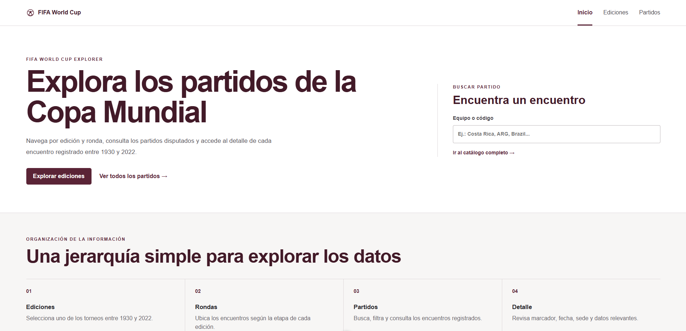

# FIFA World Cup Explorer

[](https://nuxt.com/)
[](https://vuejs.org/)
[](https://content.nuxt.com/)
[](https://fifa-world-cup-nuxt.netlify.app)
[](https://creativecommons.org/licenses/by-sa/4.0/)

Proyecto académico de **EIF 511 · Arquitectura de Información** para explorar los partidos de la Copa Mundial masculina de la FIFA entre **1930 y 2022** mediante una navegación clara y jerárquica.

**Sitio publicado:** https://fifa-world-cup-nuxt.netlify.app

## Vista previa



## Arquitectura de información

**Ediciones → Rondas → Partidos → Detalle**

- **Ediciones:** acceso a las 22 ediciones del torneo.
- **Ver edición:** búsqueda, filtro por ronda y paginación.
- **Partidos:** catálogo general con búsqueda, filtros y paginación.
- **Detalle:** marcador e información relevante del encuentro.

## Funcionalidades

- 964 partidos de 22 ediciones.
- Búsqueda y filtros contextuales.
- Paginación de 12 registros por página.
- Rutas dinámicas para ediciones y partidos.
- Diseño responsive, limpio y sin animaciones innecesarias.

## Tecnologías

- Nuxt 4
- Vue 3
- Nuxt Content
- CSV
- CSS propio

## Datos

Se utiliza una adaptación de `matches.csv` de **The Fjelstul World Cup Database**, creada por **Joshua C. Fjelstul, Ph.D.**

La adaptación conserva únicamente los partidos masculinos de 1930–2022 y los campos necesarios para la navegación y presentación.

- **Fuente:** https://github.com/jfjelstul/worldcup/blob/master/data-csv/matches.csv
- **Licencia de datos:** CC BY-SA 4.0
- **Copyright:** © 2023 Joshua C. Fjelstul, Ph.D.

## Ejecución local

```bash
npm install
npm run dev
```
